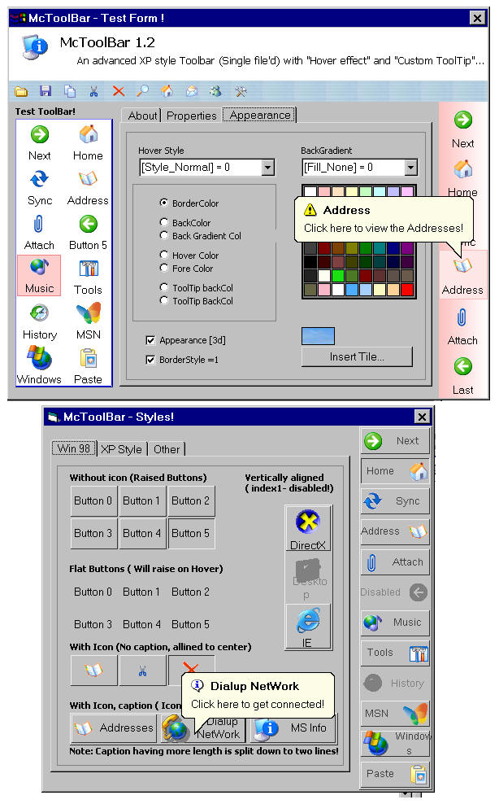



## McToolBar 1\.4 \- \[ Advanced, Ownerdraw, SingleFile'd, XP style ToolBar \] \(\*\*Updated 14/10/05\*\*\)

### Description

This is an advanced, single file'd, ownerdraw toolbar with, XPstyle/Normal HoverEffect, Custom ToolTips with balloon style and icons, Unicode support, fully customizable Gradient effects, Tiled background and many more... It is stylish, customizable and easy to use. The control does not use any property pages for item manipulation! All the opeartions can be done directly from the vb's property window. I think it is a well packed control with the most powerful routines. Chek this first release (may contain bugs)... and give me ur valuable feedbacks and comments!!! Jim Jose :-))
 
### More Info
 

             |
---                |---
**Submitted On**   |2005-07-28 10:49:46
**By**             |[JJJJJJJJ](https://github.com/Planet-Source-Code/PSCIndex/blob/master/ByAuthor/jjjjjjjj.md)
**Level**          |Intermediate
**User Rating**    |4.9 (192 globes from 39 users)
**Compatibility**  |VB 6\.0
**Category**       |[Custom Controls/ Forms/  Menus](https://github.com/Planet-Source-Code/PSCIndex/blob/master/ByCategory/custom-controls-forms-menus__1-4.md)
**World**          |[Visual Basic](https://github.com/Planet-Source-Code/PSCIndex/blob/master/ByWorld/visual-basic.md)
**Archive File**   |[McToolBar\_19400110132005\.zip](https://github.com/Planet-Source-Code/jjjjjjjj-mctoolbar-1-4-advanced-ownerdraw-singlefile-d-xp-style-toolbar-updated-14-10-05__1-62769/archive/master.zip)

